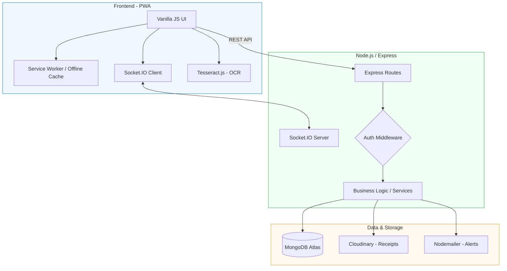

<h1 align="center">💸 ExpenseFlow</h1>
  <p align="center">The Ultimate Full-Stack Smart Expense Tracker</p>
  
<p align="center">
  
  
  
</p>

**ExpenseFlow** is a modern, responsive **expense tracking web application** designed to help users manage their finances efficiently.  
With a clean, elegant dark-themed UI and smart features like analytics, goals, and an AI-powered chatbot, ExpenseFlow makes money management simple and intuitive.
**ExpenseFlow** is a modern and responsive **full-stack expense tracking web application** designed to help users manage their finances efficiently.
With a clean and elegant dark-themed UI, it allows users to monitor spending, analyze balance, and achieve their financial goals effortlessly.

The application features a robust Node.js/Express backend with MongoDB database, real-time synchronization, advanced analytics, and comprehensive security measures.

---

## 🔗 Quick Links
- 🚀 [Live Demo](https://expenseflow-pearl.vercel.app)
- 📚 [Backend Documentation](BACKEND.md)
- 🗄️ [Database Documentation](DATABASE.md)
- 🛡️ [Setup & Security](SETUP_AND_SECURITY.md)
- ⚙️ [Getting Started](#-Getting-started)
- 🐛 [Report a Bug](https://github.com/Renu-code123/ExpenseFlow/issues)
- ✨ [Request a Feature](https://github.com/Renu-code123/ExpenseFlow/issues)

---

## 🧭 Table of Contents
- [✨ Features](#-features)
- [🤖 Chatbot Feature](#-chatbot-feature)
- [🛠️ Tech Stack](#️-tech-stack)
- [📂 Folder Structure](#-folder-structure)
- [🚀 How to Run Locally](#-how-to-run-locally)
- [📸 Screenshots](#-screenshots)
- [🧩 Future Enhancements](#-future-enhancements)
- [🎯 Learning Outcomes](#-learning-outcomes)
- [🤝 Contributing](#-contributing)
- [🧾 License](#-license)
- [👩‍💻 Author](#author)

---

## ✨ Features

- 📊 **Smart Dashboard** – Displays total balance, income, expenses, and recent activity  
- 💰 **Expense & Income Management** – Add, edit, or delete transactions easily  
- 🎯 **Goal Tracking** – Set financial goals and monitor progress visually  
- 📈 **Analytics View** – Understand spending patterns through insights  
- 🤖 **Finance Chatbot** – Get instant help, tips, and app guidance  
- 🌙 **Dark Mode UI** – Sleek, eye-friendly dark-themed interface  
- ⚙️ **Responsive Design** – Works seamlessly on desktop and mobile  
- 🔐 **PWA Ready** – Offline access using service workers and manifest

### Advanced Features
- 🔄 **Real-time Sync** – Cross-device synchronization with Socket.IO ✅
- 💱 **Multi-currency Support** – Automatic currency conversion and exchange rates ✅
- 📱 **Receipt Management** – OCR-powered receipt scanning and storage ✅
- 🔔 **Smart Notifications** – Budget alerts, goal reminders, and security notifications ✅
- 🤖 **AI Categorization** – Machine learning-powered expense categorization ✅
- 📊 **Advanced Analytics** – Detailed spending insights and trends ✅
- 🔒 **Security First** – Rate limiting, input sanitization, and security monitoring ✅
- 📤 **Data Export** – Export financial data in multiple formats ✅
- 👥 **Group Expense Management** – Create groups and manage shared expenses ✅
- 💸 **Expense Splitting** – Split expenses among group members with payment tracking ✅

---

## 🤖 Chatbot Feature

ExpenseFlow includes an **interactive chatbot** to enhance user experience and accessibility.

### 💡 What the Chatbot Can Do:
- 🧭 Guide users on how to use the app  
- 💬 Answer common finance-related questions  
- 📊 Explain dashboard data and features  
- 🎯 Help users understand goal tracking  
- ❓ Provide instant assistance without leaving the page  

The chatbot improves usability by acting as a **virtual finance assistant**, making ExpenseFlow more beginner-friendly and engaging.
ExpenseFlow is a comprehensive **full-stack expense tracking application** built with modern web technologies.
It combines a responsive frontend with a powerful backend API, providing users with a complete financial management solution.

The app emphasizes:
- User-centered design
- Visual representation of financial data
- Scalable architecture for future enhancements
- Security and performance optimization
- Cross-platform compatibility

---

## 🤔 Why ExpenseFlow?

Managing personal finances shouldn't be complicated. **ExpenseFlow** is designed to simplify money management through a clean, distraction-free interface, helping users gain total visibility into their spending habits.

### For Users
* **Build Financial Awareness:** Track every penny with ease and visualize where your money goes.
* **Goal Oriented:** Don't just track; save. Set milestones and watch your progress in real-time.
* **Smart Automation:** Use OCR to scan receipts and AI to categorize expenses, saving you time.

### For Developers
* **Real-World Logic:** A perfect example of managing complex DOM states in Vanilla JavaScript.
* **Scalable Architecture:** A solid foundation demonstrating how to bridge a PWA frontend with a robust Node.js/MongoDB backend.
* **Modern Tooling:** Deep dive into Socket.io for real-time sync and Tesseract.js for browser-based machine learning.

---

## 🛠️ Tech Stack

| Category | Technologies |
| :--- | :--- |
| **Frontend** | HTML5, CSS3, JavaScript (Vanilla JS), Tailwind CSS |
| **Backend** | Node.js, Express.js |
| **Database** | MongoDB with Mongoose ODM |
| **Real-time & Sync** | Socket.IO |
| **Authentication** | JWT (JSON Web Tokens) |
| **Intelligence & OCR** | Tesseract.js (OCR), AI-based Categorization Logic |
| **Storage & Media** | Cloudinary (Receipt Management) |
| **Communication** | Nodemailer (Email Alerts), Multi-channel Push Notifications |
| **Security** | Helmet.js, Rate Limiting, Input Sanitization |
| **PWA Support** | Web App Manifest, Service Workers (`sw.js`) |
| **DevOps & Deployment** | Docker, Vercel, Railway, Git/GitHub |

---

## 🏗️ System Architecture



--- 

## 📂 Folder Structure

```text
ExpenseFlow/
├── public/                 # 🌐 FRONTEND (Client-Side PWA)
│   ├── index.html          # Main Entry Point
│   ├── expensetracker.css  # Global Styles & UI Components
│   ├── trackerscript.js    # Core Frontend Logic & DOM
│   ├── manifest.json       # PWA Configuration
│   ├── sw.js               # Offline Caching Service Worker
│   ├── sw-notifications.js # Push Notification Logic
│   └── components/         # Static Pages (About, Privacy, Tips)
│
├── models/                 # 🗄️ BACKEND: MongoDB Schema Definitions
│   ├── User.js             # User Auth & Profile
│   ├── Expense.js          # Transaction Records
│   ├── Goal.js             # Financial Targets
│   └── ...                 # Analytics, Receipts, & Recurring Models
│
├── routes/                 # 🛣️ BACKEND: API Endpoints (REST)
│   ├── auth.js             # Login & Registration
│   ├── expenses.js         # CRUD Operations
│   ├── receipts.js         # OCR & Image Processing
│   └── ...                 # Analytics, Sync, & Group Routes
│
├── middleware/             # 🛡️ BACKEND: Security & Processing
│   ├── auth.js             # JWT Verification
│   ├── rateLimit.js        # DDoS Protection
│   └── uploadMiddleware.js # Cloudinary/Multer Handling
│
├── services/               # ⚙️ BACKEND: Business Logic & Third-Party
│   ├── emailService.js     # Nodemailer Integration
│   ├── analyticsService.js # Data Aggregation Logic
│   └── cronJobs.js         # Automated Task Scheduling
│
├── server.js               # 🚀 Main Entry Point (Express & Socket.io)
├── .env.example            # Environment Variable Template
├── docker-compose.yml      # Docker Orchestration
├── package.json            # Node.js Dependencies
└── README.md               # Project Documentation
```

---

## 🚀 How to Run Locally
Choose the setup that matches your development needs: 

### Frontend-Only Mode (UI/UX Work)
Ideal if you only want to work on the styling or the Vanilla JS interface.
* **Prerequisites:** A browser and a local server extension (like VS Code Live Server).
* **Steps:**
     1. Open the project in VS Code.
     2. Navigate to the `public/` folder.
     3. Right-click `index.html` and select "**Open with Live Server**".

> **Note:** Backend features like OCR, Cloudinary uploads, and Database persistence will not work in this mode.

### Full-Stack Mode (Complete Development)
Ideal for working on API routes, MongoDB integration, or Socket.io features.
* **Prerequisites:** Node.js (v16+), MongoDB (Local or Atlas).
* **Steps:**
1. **Clone the repo:**
```bash
git clone https://github.com/Renu-code123/ExpenseFlow.git
cd ExpenseFlow
```
2. **Install Dependencies:**
```
npm install
```
3. **Environment Variables:** Create a `.env` file in the root directory based on `.env.example`:
```bash
PORT=5000
MONGO_URI=your_mongodb_connection_string
JWT_SECRET=your_secret_key
CLOUDINARY_URL=your_cloudinary_link
```
4. **Start the Server:**
```bash
npm start
```

**The app will be live at `http://localhost:5000`.**

### Docker Mode (Containerized)
Ideal for testing the production environment without installing local dependencies.
* **Prerequisites:** Docker Desktop installed.
* **Steps:**
1. **Build and Run:**
```bash
docker compose up -d
```
2. **Check Status:**
```bash
docker compose ps
```
3. **Stop the App:**
```bash
docker compose down
```

### 📱 Progressive Web App (PWA)
ExpenseFlow is engineered to function as a native application across all platforms.
* **Offline Access:** Utilizing `sw.js`, the application caches essential assets, allowing users to view their dashboard even without an internet connection.
* **Installation:**
     * **Desktop:** Click the "Install" icon in the address bar.
     * **Mobile:** Select "Add to Home Screen" from your browser menu.
* **Background Sync:** Transactions made offline are queued and synchronized automatically once the connection is restored.
* **Push Notifications:** Stay updated with budget alerts and goal reminders via the `sw-notifications.js` integration.

---

## 📸 Screenshots


### 🏠 Dashboard Preview

**Smart Money Management – Take control of your finances with our intuitive expense tracker.**

---

## 🧩 Future Enhancements

* 🔗 Add backend for real-time data persistence (Firebase or Node.js)
* 📊 Integrate charting tools like Chart.js for expense visualization
* 🧾 Introduce login/authentication system
* 💡 Add category filters for detailed analysis
* 📱 Improve PWA support for full offline functionality

---

## 🎯 Learning Outcomes

By building this project, you’ll learn:

* 🎨 Responsive UI design using CSS
* 🧠 DOM manipulation using vanilla JavaScript
* 📂 Managing and displaying dynamic user data
* ⚙️ Working with manifests and service workers
* 🏗️ Structuring a scalable frontend project

---

## 🤝 Contributing

Contributions are always welcome!
If you’d like to improve **ExpenseFlow**, follow these steps 👇

1. **Fork the repository**
2. **Create a new branch**
   ```bash
   git checkout -b feature-name
   ```
3. **Commit your changes**
   ```bash
   git commit -m "Added a new feature"
   ```
4. **Push to your branch**
   ```bash
   git push origin feature-name
   ```
5. **Open a Pull Request**

---

## All Contributors

<a href="https://github.com/Renu-code123/ExpenseFlow/graphs/contributors">
  
</a>

💖 Thanks to all the amazing contributors who are helping build and improve **ExpenseFlow**!

---

## 🧾 License
This project is licensed under the **MIT License** – see the [LICENSE](./LICENSE) file for details.

---

## Author

**Renu Kumari Prajapati**
🎓 Information Technology Student | 💻 Frontend Developer | 🌍 Open Source Enthusiast
📫 **Connect with me:**
* **GitHub:** [@Renu-code123](https://github.com/Renu-code123)
  
---

## 🧑‍💻 Core Team

| Name | Role |
|------|------|
| Renu Kumari Prajapati | Project Admin |
| Harshit Singh | Mentor |

---

## 💬 Quote

> “Smart money management begins with awareness — track it, plan it, and grow it with **ExpenseFlow**.”

---

## 🌟 Show Some Love

If you found this project useful, don’t forget to ⭐ **Star** the repository!
Let’s build smarter tools for financial awareness together 💜
